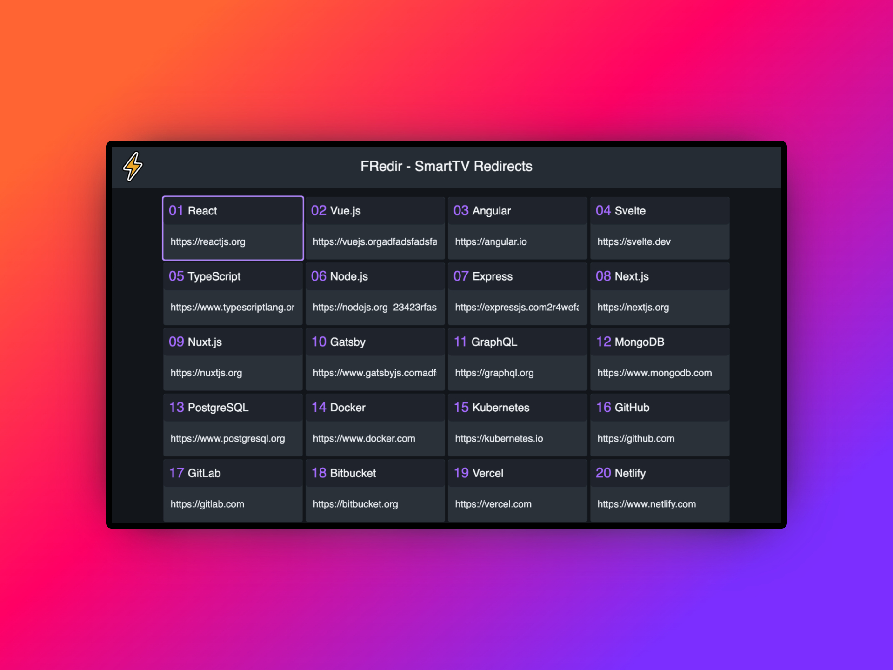

# Fredir - Smart TV Redirect App

A lightweight web application built with LightningJS and Blits Smart TV Framework, designed specifically for Smart TVs to handle URL redirections with a user-friendly interface.



## Features

- Simple and intuitive navigation optimized for TV remote controls
- Customizable redirect links
- Built specifically for Smart TV experiences
- Easy setup and configuration

## Getting Started

### Prerequisites

- Node.js (v14 or higher)
- npm or yarn

### Installation

1. Clone the repository:
   ```bash
   git clone https://github.com/froma-dev/fredir.git
   cd fredir
   ```

2. Install dependencies:
   ```bash
   npm install
   # or
   yarn install
   ```

3. Start the development server:
   ```bash
   npm run dev
   # or
   yarn dev
   ```

## Configuration

Edit the `public/redirs/redirects.json` file to add or modify your redirect links. The format should be:

```json
[
  {
    "id": 1,
    "title": "React",
    "url": "https://reactjs.org"
  },
  {
    "id": 2,
    "title": "Vue.js",
    "url": "https://vuejs.org"
  }
]
```

## Building for Production

To create a production build:

```bash
npm run build
# or
yarn build
```

## Caveats
### Blocked request
When using local DNS such as ```local.me.dev:5173``` you will get a blocked request error.
```sh
Blocked request. This host("local.me.dev") is not allowed. To allow this host, add "local.me.dev" to server.allowedHosts in vite.config.js
```

## Technologies Used

- LightningJS
- Blits Smart TV Framework
- TypeScript

## License

This project is licensed under the MIT License - see the [LICENSE](LICENSE) file for details.
